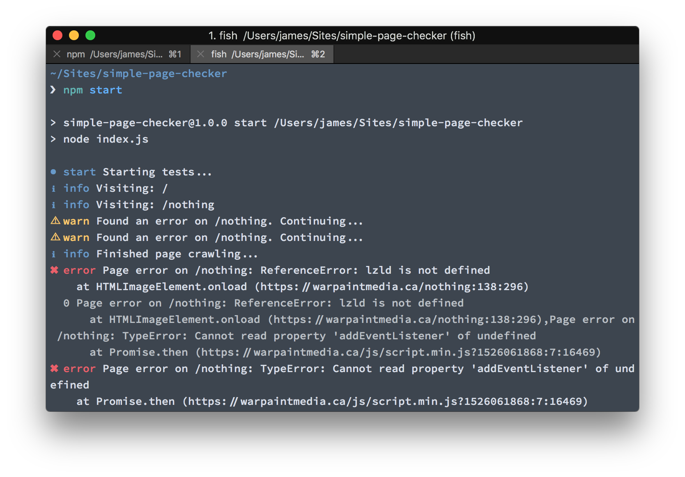

simple-page-checker
=====================

> Run [GoogleChrome/puppeteer](https://github.com/GoogleChrome/puppeteer) over a list of pages and check for errors in them



### Setup

* `npm install`
* create `config.json`
* use the following scaffolding:

```json
{
  "baseUrl": "",
  "pages": [
    "/"
  ],
  "timeout": 120000,
  "additionalDelay": 2000,
  "concurrentPages": 5,
  "launchOptions": {
    "headless": true
  }
}
```

### Running

* `npm start`
